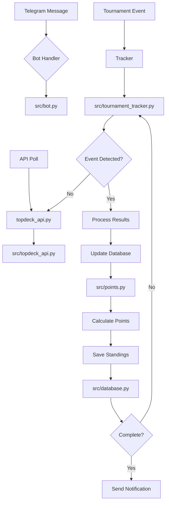

# Complete Setup and Development Guide for TopDeck Telegram Bot

## Table of Contents

1. [Introduction](#introduction)
2. [Prerequisites](#prerequisites)
3. [Initial Setup](#initial-setup)
4. [Configuration](#configuration)
5. [Running the Bot](#running-the-bot)
6. [Development Workflow](#development-workflow)
7. [Code Architecture](#code-architecture)
8. [Database Management](#database-management)
9. [API Integration](#api-integration)
10. [Testing](#testing)
11. [Deployment](#deployment)
12. [Troubleshooting](#troubleshooting)
13. [Next Steps](#next-steps)

---

## Introduction

This guide will walk you through setting up and developing the Telegram bot for TopDeck tournament tracking. The bot monitors tournaments hosted by specific users on TopDeck, notifies your group when they complete, and updates points standings.

### What This Bot Does

- **Monitors Tournaments**: Tracks all tournaments from specified TopDeck users
- **Auto-notifications**: Alerts when tournaments finish or cancel
- **Standings Updates**: Calculates and updates team standings (logic TBD)
- **Command Interface**: Manage tracking via Telegram commands

---

## Prerequisites

Before starting, ensure you have:

- ✅ Python 3.11+ installed
- ✅ A Telegram account
- ✅ Bot token from [@BotFather](https://telegram.org/blog/bots#creating-your-own-bot)
- ✅ TopDeck API access and credentials
- ✅ Basic understanding of REST APIs

### Installing Prerequisites

```bash
# Check Python version
python --version  # Should be 3.11 or higher

# Install pip if needed
python -m ensurepip --upgrade

# Install curl for API testing
# On Windows (Chocolatey)
choco install curl

# Or download from https://curl.se/windows/
```

---

## Initial Setup

### Step 1: Create Telegram Bot

1. Open Telegram and search for **@BotFather**
2. Send `/newbot` command
3. Follow instructions to choose a username
4. Save the token provided (you'll need it!)

### Step 2: Get TopDeck API Credentials

1. Log into your TopDeck account
2. Navigate to developer/API settings
3. Register your application
4. Copy Client ID, Client Secret, and API URL

### Step 3: Clone Repository

```bash
git clone <your-repo-url>
cd telegrambot
```

### Step 4: Create Virtual Environment

```bash
# Create virtual environment
python -m venv venv

# Activate it
# Windows:
venv\Scripts\activate
# Linux/Mac:
source venv/bin/activate
```

### Step 5: Install Dependencies

```bash
pip install -r requirements.txt
```

Or if you prefer Poetry:

```bash
poetry install
```

---

## Configuration

### Creating `.env` File

Copy the example file and edit with your values:

```bash
cp .env.example .env
code .env  # Edit with your IDE
```

### Required Environment Variables

| Variable | Description | Example |
|----------|-------------|---------|
| `BOT_TOKEN` | Your Telegram bot token | `123456:ABC-DEF...` |
| `TOPDECK_API_URL` | TopDeck API base URL | `https://api.topdeck.com/v1` |
| `TOPDECK_CLIENT_ID` | Your Client ID | `client_abc123` |
| `TOPDECK_CLIENT_SECRET` | Your Client Secret | `secret_xyz789` |
| `TARGET_USER_ID` | User(s) whose tournaments to track | `user1,user2,user3` |
| `TOPDECK_POLL_INTERVAL` | Seconds between API checks | `60` |
| `DATABASE_PATH` | Path to SQLite database | `data/tournaments.db` |

### Optional Environment Variables

```bash
# Bot behavior
NOTIFY_ON_COMPLETE=true        # Notify on tournament completion
AUTO_UPDATE_STANDINGS=true     # Auto-update standings on events
DEBUG=false                    # Enable debug logging
LOG_LEVEL=INFO                # DEBUG, INFO, WARNING, ERROR

# Performance tuning
API_CALL_RETRIES=3            # Number of retry attempts
API_CALL_TIMEOUT=30           # Seconds before timeout
CACHE_ENABLED=true            # Use in-memory cache for API calls
CACHE_TTL=60                  # Cache time-to-live in seconds

# Logging
LOG_FORMAT=plain              # plain or json
LOG_FILE=logs/bot.log        # Optional log file path
```

---

## Running the Bot

### Development Mode

```bash
python src/bot.py
```

### Production Mode (with Supervisor)

1. Install supervisor:
   ```bash
   pip install supervisor
   ```

2. Create `supervisor.conf`:
   ```ini
   [program:telegram-bot]
   command=python src/bot.py
   directory=/path/to/telegrambot
   user=your-username
   autostart=true
   autorestart=true
   stdout_logfile=/var/log/bot.log
   stderr_logfile=/var/log/bot_error.log
   ```

3. Start supervisor:
   ```bash
   supervisorctl start all
   ```

### Testing with Docker (Optional)

See the `docker/` directory for containerization instructions.

```bash
docker-compose up -d
```

---

## Development Workflow

### Adding New Features

1. **Create a feature branch:**
   ```bash
   git checkout -b feature/new-feature-name
   ```

2. **Make your changes** in relevant files

3. **Write tests** in `tests/` directory:
   ```bash
   pytest tests/test_new_feature.py
   ```

4. **Run linters:**
   ```bash
   flake8 src/
   black --check src/
   ```

5. **Commit your changes:**
   ```bash
   git add .
   git commit -m "Add new feature: [description]"
   ```

### Code Style Guidelines

- Use type hints (Python 3.10+ recommended):
  ```python
  def calculate_points(tournament: Tournament, team: Team) -> int:
      ...
  ```

- Follow PEP 8 style guide
- Document public functions with docstrings
- Keep functions focused and small (< 20 lines ideal)
- Use meaningful variable names

### Branching Strategy

```
main          # Production code with only completed features
dev           # Integration branch for active development
feature/*     # Individual feature branches
fix/*         # Bug fixes
```

---

## Code Architecture

### File Overview

| File | Purpose | Key Functions |
|------|---------|---------------|
| `src/config.py` | Configuration loader | load_config() |
| `src/database.py` | Database operations | init_db(), query_tournaments() |
| `src/bot.py` | Bot initialization | initialize_bot(), register_handlers() |
| `src/topdeck_api.py` | API client | fetch_tournaments(), parse_tournament_data() |
| `src/tournament_tracker.py` | Tournament logic | detect_completion(), process_results() |
| `src/points.py` | Points calculation (TODO) | calculate_points(), update_standings() |
| `src/utils/logging.py` | Logging setup | configure_logging() |

### Component Flow



---

## Database Management

### Database Location

The SQLite database is stored at `data/tournaments.db` by default.

### Initializing Database

```python
from src.database import init_db, get_db_path

# Initialize on startup
db_path = get_db_path()
init_db(db_path)
```

### Available Tables

- **tournaments**: Track tournament metadata and status
- **players**: Player/team info per tournament
- **standings**: Current standings with points, wins, losses

### Running Migrations

If database schema changes:

```bash
# Create migration script
python migrations/create_migration.py

# Run migrations
python migrate.py upgrade
```

---

## API Integration

### Authentication

The bot uses OAuth2 for TopDeck API access:

```python
from src.topdeck_api import TopDeckClient

client = TopDeckClient(
    api_url=config['TOPDECK_API_URL'],
    client_id=config['TOPDECK_CLIENT_ID'],
    client_secret=config['TOPDECK_CLIENT_SECRET']
)
```

### Fetching Tournaments

```python
from src.topdeck_api import get_user_tournaments

# Get tournaments for specific user
tournaments = await get_user_tournaments(
    client,
    user_id='user123'
)

# Filter active tournaments
active = [t for t in tournaments if t['status'] == 'ongoing']
```

### Error Handling

The API client includes built-in retry logic:

```python
from src.topdeck_api import TopDeckError

try:
    response = await client.fetch('/tournaments')
except TopDeckError as e:
    logger.error(f"API error: {e}")
    # Retry or fallback to polling
```

---

## Testing

### Running Tests

```bash
pytest tests/ -v --tb=short
```

### Test Coverage

```bash
pytest --cov=src --cov-report=html
open htmlcov/index.html  # View coverage report
```

### Writing Tests

```python
import pytest
from src.tournament_tracker import detect_completion
from unittest.mock import Mock

def test_detect_completion_ongoing():
    mock_tournament = Mock()
    mock_tournament.status = 'ongoing'
    
    result = detect_completion(mock_tournament)
    assert result == False

def test_detect_completion_finished():
    mock_tournament = Mock()
    mock_tournament.status = 'finished'
    
    result = detect_completion(mock_tournament)
    assert result == True
```

---

## Deployment

### Local Production

1. **Set production environment:**
   ```bash
   export DEBUG=false
   export LOG_LEVEL=WARNING
   ```

2. **Use systemd or supervisor for process management**

3. **Enable database backups:**
   Create `scripts/backup_database.sh`:
   ```bash
   #!/bin/bash
   BACKUP_DIR="/backups/telegrambot"
   sqlite3 data/tournaments.db ".backup $BACKUP_DIR/$(date +%Y%m%d).db"
   ```

### Docker Deployment

1. Build image:
   ```bash
   docker build -t telegrambot .
   ```

2. Run container:
   ```bash
   docker run -d \
     -v /path/to/data:/app/data \
     -e BOT_TOKEN=your_token \
     --name telegrambot telegrambot
   ```

### Cloud Deployment (AWS/Heroku/etc)

1. Set environment variables in your cloud provider's dashboard
2. Deploy container or zip package
3. Configure database persistence (use RDS, DynamoDB, etc.)

---

## Troubleshooting

### Bot Not Responding

```bash
# Check if process is running
ps aux | grep bot.py

# Check logs
tail -f logs/bot.log

# Restart
python src/bot.py
```

### API Connection Errors

1. Verify credentials in `.env`
2. Check network connectivity to TopDeck servers
3. Review error messages in logs
4. Try manual API call with `curl`:
   ```bash
   curl -X GET "https://api.topdeck.com/v1/tournaments" \
     -H "Authorization: Bearer YOUR_TOKEN"
   ```

### Database Issues

```bash
# Check database file exists
ls -la data/*.db

# Verify SQLite integrity
sqlite3 data/tournaments.db ".integrity_check"

# Backup current database
cp data/tournaments.db data/tournaments_backup.db
```

### Memory Usage High

- Clear in-memory cache: `cache.clear()`
- Increase cache TTL or disable if memory-constrained
- Review polling interval settings

---

## Next Steps

### Immediate Priorities

1. ✅ **Complete current setup** - Environment, dependencies configured
2. 🔄 **Implement point logic** - Work on `src/points.py`
3. 📝 **Add admin commands** - `/admin-*` command handlers
4. 🔒 **Enhance security** - API key rotation, rate limiting
5. 🧪 **Write integration tests** - Test full bot flow

### Future Enhancements

- [ ] Implement Redis caching for improved performance
- [ ] Add webhook support (when TopDeck provides it)
- [ ] Create admin dashboard (Flask/FastAPI web interface)
- [ ] Export standings to CSV/PDF reports
- [ ] Multi-team support across Telegram groups
- [ ] Tournament history analytics
- [ ] Custom point system configurations per tournament type

### Documentation Updates Needed

- [ ] Add examples for each command handler
- [ ] Document all database queries
- [ ] Create architecture diagrams
- [ ] Write integration test suite
- [ ] Add deployment guides for different platforms

---

## Getting Help

If you encounter issues:

1. Check the logs: `tail -f logs/bot.log`
2. Review similar issues in documentation
3. Test with sample data and minimal configuration
4. Open an issue on GitHub with relevant error messages

## Contributing

This is an internal project. If contributing:

- Follow existing code style
- Write comprehensive tests
- Document all changes
- Update this guide as needed

---

**Happy coding! 🚀**

For questions or issues, check the troubleshooting section above or review logs in `logs/`.